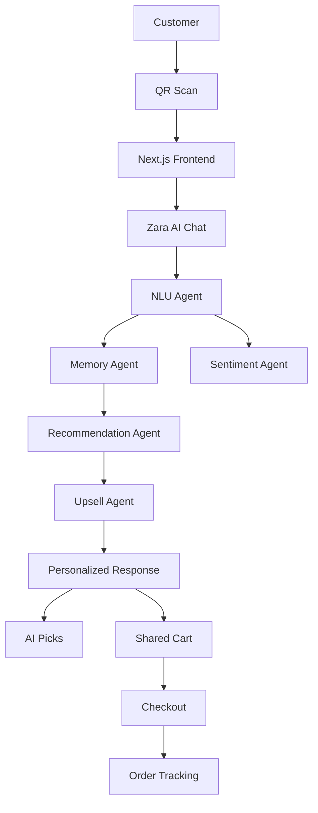

# Zara – AI-Powered Smart Dining Assistant

## Live Demo

**Demo URL:**
https://smart-dining-assistant-beta.vercel.app/

# Project Overview

Zara is an AI-powered dining concierge that enhances the restaurant ordering experience through conversational recommendations, personalized menu discovery, group ordering, and intelligent upselling.

# Setup Instructions

### 1. Clone Repository

```bash
git clone <repository-url>
cd smart-dining-assistant
```

### 2. Install Dependencies

```bash
npm install
```

### 3. Configure Environment Variables

Create a `.env.local` file:

```env
GROQ_API_KEY=your_groq_api_key
```

### 4. Start Development Server

```bash
npm run dev
```

### 5. Open Application

```txt
http://localhost:3000/table/T12
```

# Architecture Diagram



# Agent Design

The application follows a multi-agent architecture where each agent has a specific responsibility.

## 1. NLU Agent

### Responsibility

Interprets user messages and extracts:

* User intent
* Dietary preferences
* Food preferences
* Language preference

### Example

Input:

```txt
I'm vegetarian and want something spicy.
```

Output:

```json
{
  "intent":"RECOMMEND",
  "preferences":["veg","spicy"],
  "language":"english"
}
```

### Tools Available

* Groq LLM
* User message

---

## 2. Memory Agent

### Responsibility

Maintains session context for each table.

Stores:

* Previous preferences
* Conversation history
* Session-specific information

### Example

If a user previously mentioned:

```txt
I am vegetarian.
```

Future recommendations continue respecting vegetarian preferences without requiring the user to repeat them.

### Tools Available

* Session store
* Table ID
* Conversation history

---

## 3. Recommendation Agent

### Responsibility

Generates personalized menu recommendations.

Considers:

* User preferences
* Session context
* Dietary restrictions
* Menu metadata
* Mood selection

### Example

User:

```txt
Recommend something spicy and vegetarian.
```

Response:

```txt
Paneer Tikka
Veg Biryani
Masala Fries
```

### Tools Available

* Menu database
* Session memory
* Groq LLM

---

## 4. Upsell Agent

### Responsibility

Suggests complementary menu items.

Examples:

```txt
Paneer Tikka
→ Mint Mojito

Veg Biryani
→ Gulab Jamun
```

The agent only recommends items that exist in the restaurant menu.

### Tools Available

* Recommendation output
* Menu metadata
* Complementary item mappings

---

## 5. Sentiment Agent

### Responsibility

Detects customer sentiment and adjusts conversational tone.

Examples:

```txt
Happy
Excited
Neutral
Confused
```

### Tools Available

* User messages
* Groq LLM

---

# Design Decisions

## Why Next.js?

* Fast development speed
* Server-side API routes
* Easy deployment on Vercel
* Excellent React ecosystem

---

## Why Zustand?

* Lightweight state management
* Minimal boilerplate
* Easy cart synchronization
* Ideal for hackathon development

---

## Why Groq?

* Fast inference speeds
* Low latency
* Strong instruction following
* Suitable for conversational agents

# Data Model

Each menu item contains:

```json
{
  "id":"UUID",
  "name":"Item Name",
  "category":"Category",
  "price":299,
  "description":"Short description",
  "image_url":"...",
  "tags":["veg","spicy"],
  "allergens":["dairy"],
  "available":true,
  "popular_score":0.92,
  "complementary_items":["ITEM_1","ITEM_2"]
}
```

This schema supports:

* Recommendation filtering
* Dietary restrictions
* Upselling
* Availability checks
* Popularity ranking

---

# Key Features

## AI Dining Concierge

Conversational food discovery powered by multiple AI agents.

---

## Mood-Based Recommendations

Supported moods:

* Spicy
* Light
* Sweet
* Filling
* Surprise Me

Recommendations adapt immediately based on selected mood.

---

## Shared Table Ordering

Customers seated at the same table can:

* Add items collaboratively
* View shared cart
* See item ownership
* Receive synchronization notifications

---

## Intelligent Upselling

Context-aware complementary recommendations generated after menu selection.

---

## Personalized AI Picks

Dynamic recommendation cards generated using user preferences and session context.

---

## Order Tracking

Customers can track order progress after checkout.

---

# Trade-Offs

### Redis

Planned for production-grade shared state.

Replaced with:

```txt
LocalStorage + Zustand
```

for faster development.

---

### WebSockets

Planned for real-time synchronization.

Replaced with:

```txt
Browser Storage Events
```

to simplify implementation.

---

### Payment Gateway

Checkout flow ends at order confirmation.

---

# Future Improvements

With additional time:

### Real-Time Kitchen Dashboard

* Chef queue
* Order preparation status
* Live updates

### Payment Integration

* Razorpay
* UPI
* Card payments

### Recommendation Analytics

* Customer preference tracking
* Popularity prediction
* Dynamic menu optimization

### Vector Search

Semantic menu retrieval using embeddings.

---

# AI Prompt Examples

## Example 1

### User

```txt
I am vegetarian and want something spicy.
```

### Recommendation

```txt
Paneer Tikka
Hara Bhara Kebab
```

---

## Example 2

### User

```txt
Suggest something light for dinner.
```

### Recommendation

```txt
Hara Bhara Kebab
Jeera Rice
Mint Mojito
```

---

## Example 3

### User

```txt
I want something sweet after my meal.
```

### Recommendation

```txt
Gulab Jamun
Brownie
```
---

