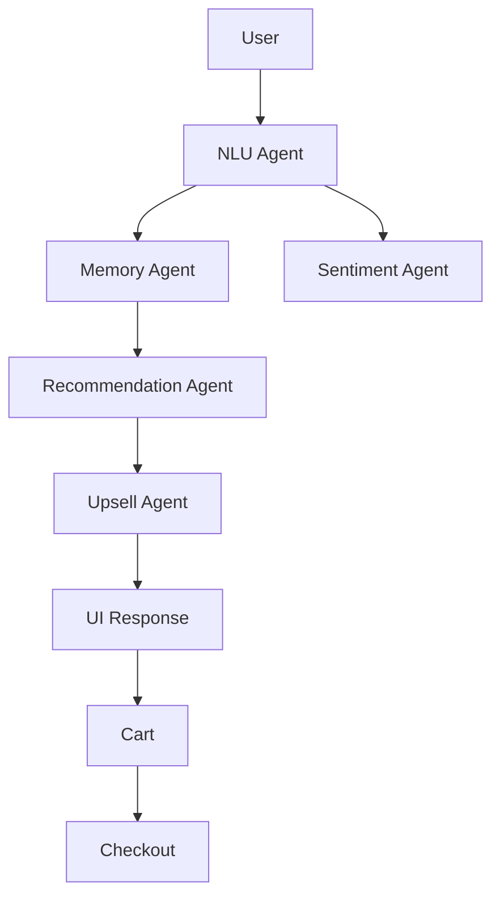

# Smart Dining Assistant

## Live Demo
<vercel link>

## Setup

1. git clone ...
2. npm install
3. Create .env.local
4. Add GROQ_API_KEY
5. npm run dev

## Architecture Diagram

## Agent Design

### NLU Agent
Extracts:
- intent
- language
- preferences

### Memory Agent
Stores:
- session preferences
- conversation history

### Recommendation Agent
Generates menu suggestions.

### Upsell Agent
Suggests complementary items.

### Sentiment Agent
Analyzes user tone.

## Design Decisions

Why:
- Next.js
- Zustand
- Groq
- Multi-Agent Pattern

## Trade-offs

Cut:
- Redis
- Real DB
- WebSockets

Future:
- Kitchen Dashboard
- Real Payments
- Voice Ordering

## Prompt Examples

Example 1
"I am vegetarian and want something spicy"

Example 2
"Suggest a light dinner"

Example 3
"Recommend something sweet"
